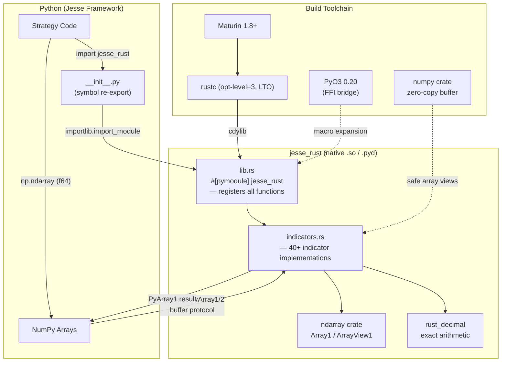
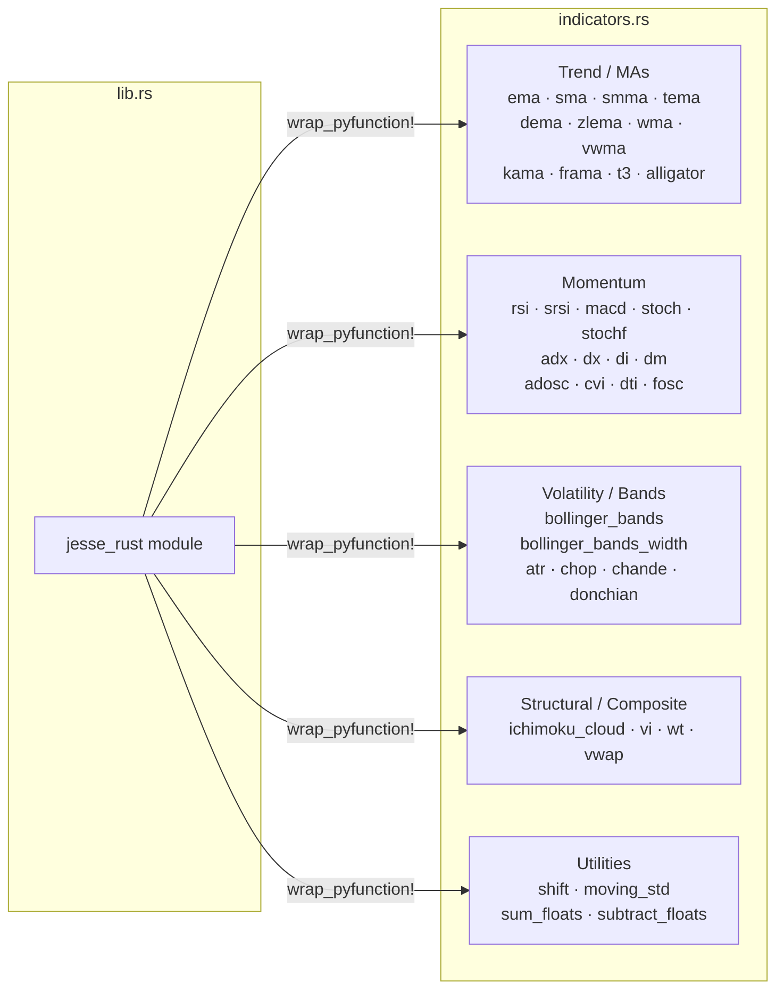

# Jesse-Rust — Architecture

## System Architecture Overview

---

## Component Breakdown

### `src/lib.rs` — Module Entry Point

**Source**: `ext-systems/jesse-rust/src/lib.rs`

The single `#[pymodule]` function `jesse_rust` wires every Rust function into the Python-callable namespace using `m.add_function(wrap_pyfunction!(...))`. It imports and re-exports everything from `indicators.rs` via `use indicators::*`.

Key responsibilities:
- Declare `mod indicators` and `use indicators::*`
- Register all ~40 public functions with PyO3
- Group functions by category (indicators, utilities, optimized indicators)

### `src/indicators.rs` — Indicator Implementations

**Source**: `ext-systems/jesse-rust/src/indicators.rs`

The entire compute engine. All functions follow the same pattern:

1. Accept `PyReadonlyArray1<f64>` (price series) or `PyReadonlyArray2<f64>` (OHLCV candles).
2. Acquire the GIL via `Python::with_gil(|py| { ... })`.
3. Get a zero-copy `ArrayView1`/`ArrayView2` from the NumPy buffer.
4. Perform rolling computations using `ndarray::Array1` output buffers and `VecDeque` for O(1) sliding windows.
5. Return `PyArray1::from_array(py, &result).to_owned()` (single series) or tuples/dicts for multi-output indicators.

### `__init__.py` — Python Shim

**Source**: `ext-systems/jesse-rust/__init__.py`

A thin wrapper that attempts `importlib.import_module("jesse_rust")` and flattens all public Rust symbols into the package namespace. Provides a graceful degradation path with a printed warning if the compiled extension is absent.

### `Cargo.toml` — Rust Manifest

**Source**: `ext-systems/jesse-rust/Cargo.toml`

Declares the library as `crate-type = ["cdylib"]` (required for Python extension modules). Defines two release profiles:

| Profile | `opt-level` | Use |
|---|---|---|
| `release` | `3` | Distribution, maximum speed |
| `release-small` | `z` | Space-constrained environments |

Both profiles enable LTO, `codegen-units = 1`, `panic = "abort"`, and symbol stripping.

### `pyproject.toml` — Python Package Metadata

**Source**: `ext-systems/jesse-rust/pyproject.toml`

Uses `maturin` as the PEP 517 build backend. Sets `module-name = "jesse_rust"` and `python-source = "."`. The `[tool.cibuildwheel]` section governs CI wheel builds for CPython 3.10–3.13 across Linux (x86_64/aarch64), macOS (x86_64/arm64), and Windows (AMD64).

---

## Module Diagram

---

## Key Dependencies

| Crate | Version | Role |
|---|---|---|
| `pyo3` | 0.20.3 | Python C-API bindings, `#[pyfunction]` / `#[pymodule]` macros |
| `numpy` | 0.20.0 | Zero-copy `PyArray1` / `PyReadonlyArray1` wrappers |
| `ndarray` | 0.15.6 | Rust-native `Array1`, slicing, column/row access |
| `rust_decimal` | 1.35.0 | Exact decimal arithmetic for currency-sensitive utilities |

---

## Candle Array Convention

**Source**: `ext-systems/jesse-rust/src/indicators.rs` (column indexing throughout)

OHLCV candles are passed as 2-D NumPy arrays with the following column layout, matching the Jesse framework convention:

| Column Index | Field |
|---|---|
| 0 | timestamp |
| 1 | open |
| 2 | close |
| 3 | high |
| 4 | low |
| 5 | volume |

Functions that accept candles (e.g., `adx`, `atr`, `ichimoku_cloud`, `chop`, `donchian`) slice columns directly: `candles_array.column(3)` → high, `candles_array.column(4)` → low, `candles_array.column(2)` → close.

---

## See Also

- [workflow.md](workflow.md) — Rust–Python data flow and processing pipeline
- [state-management.md](state-management.md) — Rolling state and internal data structures
- [development.md](development.md) — Build setup and configuration reference
