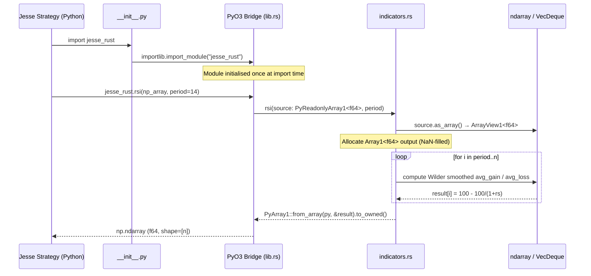
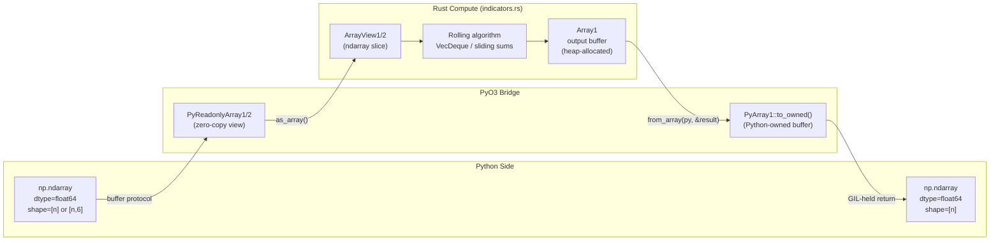
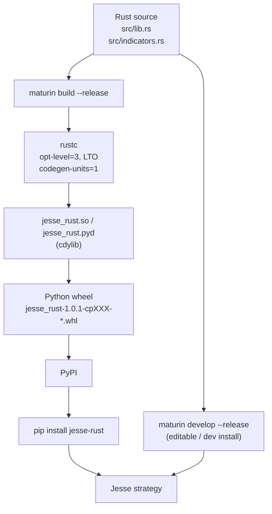

# Jesse-Rust — Workflow

## Processing Pipeline

The diagram below traces a complete indicator call from Jesse strategy code through the Rust compute layer and back.



---

## Data Flow: Rust–Python Interface



### Key Properties of the Data Flow

| Property | Detail |
|---|---|
| Input ownership | `PyReadonlyArray1` — Python owns the buffer; Rust holds a read-only view |
| Zero-copy input | No data is copied on the Python → Rust boundary |
| Output allocation | A new `Array1<f64>` is heap-allocated in Rust, then transferred into a Python-owned `PyArray1` |
| GIL management | `Python::with_gil(|py| { ... })` wraps every function body — the GIL is held for the duration of the computation |
| NaN sentinel | Output arrays are pre-filled with `f64::NAN`; only computed positions are written |

---

## Multi-Output Indicators

Several indicators return tuples or dicts instead of a single array.

| Indicator | Return type | Fields |
|---|---|---|
| `macd` | `(Array, Array, Array)` | macd_line, signal_line, histogram |
| `bollinger_bands` | `(Array, Array, Array)` | upper, middle, lower |
| `srsi` | `(Array, Array)` | %K, %D |
| `stoch` / `stochf` | `(Array, Array)` | %K, %D |
| `ichimoku_cloud` | `(f64, f64, f64, f64)` | conversion, base, span_a, span_b |
| `donchian` | `PyDict` | upperband, middleband, lowerband |
| `di` | `(Array, Array)` | +DI, -DI |

**Source**: `ext-systems/jesse-rust/src/indicators.rs` (function signatures throughout)

---

## Build and Distribution Workflow



### Build scripts

| Script | Purpose |
|---|---|
| `ext-systems/jesse-rust/build-local.sh` | Dev install: checks Rust/Python, runs `maturin develop --release`, smoke-tests import |
| `ext-systems/jesse-rust/build-all-wheels.sh` | CI/release: cross-compiles for all `rustup` targets, collects `.whl` and `.tar.gz` in `dist/` |
| `ext-systems/jesse-rust/build-comprehensive.sh` | Extended cross-compilation (all platform variants) |
| `ext-systems/jesse-rust/build-quick.sh` | Quick local wheel for the host target only |

---

## Indicator Computation Patterns

Most rolling indicator functions follow one of two performance patterns:

### Pattern A — Wilder Smoothing (exponential)

Used by: `rsi`, `adx`, `atr`, `di`, `srsi`

```
smoothed[i] = (smoothed[i-1] * (period - 1) + current) / period
```

This avoids re-scanning history on every step, giving O(1) per-element cost after initialisation.

**Source reference**: `ext-systems/jesse-rust/src/indicators.rs`, `rsi()` lines 1–65, `adx()` lines 318–409, `atr()` lines 1133–1189

### Pattern B — Sliding-Window via VecDeque

Used by: `chop`, `donchian`, `srsi` (%K/%D smoothing), `bollinger_bands`, `bollinger_bands_width`

A `VecDeque<(usize, f64)>` maintains a monotonic deque of (index, value) pairs. Expired entries are popped from the front in O(1) amortised time, giving O(n) overall complexity for window max/min queries.

**Source reference**: `ext-systems/jesse-rust/src/indicators.rs`, `donchian()` lines 1352+, `chop()` lines 987+

---

## See Also

- [architecture.md](architecture.md) — Component overview and dependency table
- [state-management.md](state-management.md) — Internal rolling-state structures
- [development.md](development.md) — Setup and build instructions
